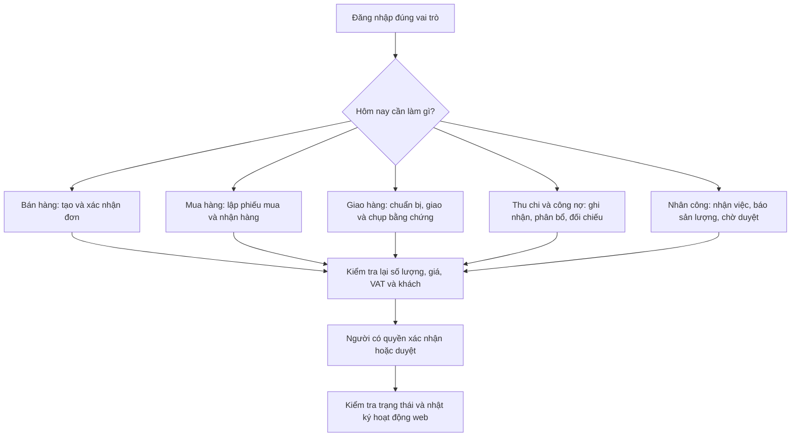

# Sổ tay hướng dẫn sử dụng VLXD Hiền Xá

> Dành cho: chủ cửa hàng, kế toán, bán hàng, kho, điều phối/giao hàng, thợ, khách hàng và nhà cung cấp.
>
> Mục tiêu: làm đúng một việc tại một thời điểm, luôn kiểm tra số tiền và số lượng trước khi xác nhận.

## 1. Cách dùng an toàn

1. Đăng nhập bằng đúng tài khoản của mình. Không dùng chung tài khoản.
2. Chọn công việc từ menu bên trái hoặc nút **Mở menu** trên điện thoại.
3. Tạo chứng từ ở trạng thái **Nháp** trước; kiểm tra lại rồi mới **Xác nhận** hoặc **Duyệt**.
4. Đợi thông báo hoàn tất trước khi bấm tiếp. Không bấm nút xác nhận hai lần.
5. Chứng từ đã ghi nhận tiền, kho hoặc công nợ không sửa trực tiếp. Khi sai, báo người có quyền thực hiện **đảo chứng từ** hoặc điều chỉnh có lịch sử.

## 2. Bản đồ công việc hằng ngày

Sơ đồ dùng riêng khi hướng dẫn:

- [Vai trò và việc được phép làm - bản chi tiết](diagrams/user-guide-role-map-detailed.mmd)
- [Bán hàng đến giao hàng - bản chi tiết](diagrams/user-guide-sales-delivery-detailed.mmd)
- [Mua hàng, nhập kho và thanh toán - bản chi tiết](diagrams/user-guide-purchase-inventory-cash-detailed.mmd)
- [Ba sơ đồ tóm tắt](diagrams/user-guide-role-map.mmd), [bán hàng](diagrams/user-guide-sales-delivery.mmd), [mua hàng](diagrams/user-guide-purchase-cash.mmd)

## 3. Hướng dẫn theo vai trò

| Vai trò | Việc chính | Khi nào hoàn tất |
| --- | --- | --- |
| Chủ cửa hàng | Xem tổng quan, duyệt việc quan trọng, xem công nợ và nhật ký | Trạng thái có chữ `Đã xác nhận`, `Đã duyệt` hoặc `Đã hoàn tất` |
| Kế toán | Phiếu thu, phiếu chi, phân bổ, đối soát chứng từ chuyển khoản | Chứng từ đúng số tiền, phân bổ không vượt số dư |
| Bán hàng | Tạo khách, lập đơn nháp, kiểm tra giá/VAT, theo dõi giao | Đơn được xác nhận và có kế hoạch nguồn hàng/giao |
| Kho | Nhận hàng, xuất hàng, kiểm kê, báo chênh lệch | Số lượng thực tế đã được người có quyền duyệt khi cần |
| Điều phối/tài xế | Tạo chuyến, bốc hàng, giao hàng, cập nhật bằng chứng | Chuyến có trạng thái `Đã giao` hoặc yêu cầu duyệt đang chờ xử lý |
| Thợ | Nhận việc, ghi sản lượng, chụp ảnh bằng chứng | Việc đã gửi; tiền công chỉ xuất hiện sau khi được duyệt |
| Khách hàng | Đặt đơn, xem đơn của mình, công nợ của mình, gửi minh chứng chuyển khoản, nhắn tin | Đơn có phản hồi của cửa hàng hoặc minh chứng đang chờ đối soát |
| Nhà cung cấp | Xem phiếu mua của mình, phản hồi khả năng cung ứng, báo giao, nhắn tin | Cửa hàng đã kiểm tra và ghi nhận theo quy trình nhập/giao |

## 4. Bán hàng và giao hàng

### 4.1 Lập đơn bán

1. Mở **Bán hàng**.
2. Chọn khách hàng; nếu chưa có, tạo khách hàng trong **Danh mục**.
3. Thêm vật tư, đơn vị bán, số lượng, đơn giá và VAT.
4. Kiểm tra tổng tiền, giá và điều kiện giao trước khi lưu nháp.
5. Người có quyền bấm **Xác nhận đơn**. Sau bước này, không thay giá của đơn bằng cách sửa bảng giá chung.

### 4.2 Chuẩn bị và giao hàng

1. Phân bổ nguồn hàng: xuất từ kho hoặc giao thẳng từ nhà cung cấp.
2. Tạo chuyến giao, chọn tài xế và xe. Một xe/tài xế không nên có hai chuyến đang chạy trong cùng ngày.
3. Tài xế/nhân viên giao hàng thực hiện lần lượt: **Bắt đầu bốc hàng** → **Xuất phát** → **Xác nhận đã giao**.
4. Nhập đúng số lượng thực giao, tên người nhận hoặc lý do không nhận; chụp ảnh khi hệ thống yêu cầu.
5. Nếu thợ gửi xác nhận giao, chủ cửa hàng hoặc kế toán phải duyệt trước khi phát sinh xuất kho và phải thu.

### 4.3 Nếu giao sai hoặc khách trả hàng

- Không tự sửa số lượng của chứng từ đã ghi.
- Ghi rõ sự việc và liên hệ chủ cửa hàng/kế toán để tạo thao tác đảo hoặc điều chỉnh có lịch sử.
- Không dùng phiếu thu/phiếu chi để che chênh lệch hàng.

## 5. Mua hàng, nhập kho và kiểm kho

### 5.1 Lập phiếu mua

1. Mở **Mua hàng**, chọn nhà cung cấp và từng dòng vật tư.
2. Chọn đúng đơn vị mua đã được cấu hình. Với đơn vị theo xe/thực tế, nhập lượng tồn kho thực nhận theo hướng dẫn trên màn hình.
3. Chọn nơi nhận: **Kho cửa hàng** hoặc **Giao thẳng khách**.
4. Kiểm tra số lượng, giá mua, VAT và ảnh chứng từ nếu có; lưu nháp rồi xác nhận.

### 5.2 Nhận hàng

1. Mở phiếu mua đã xác nhận.
2. Nhập số lượng thực nhận; không vượt số lượng còn chờ nhận.
3. Chụp/đính kèm ảnh chứng từ nếu quy trình yêu cầu.
4. Với giao thẳng khách, không tự tạo nhập/xuất ở kho cửa hàng.
5. Nếu người gửi là thợ, người có quyền phải duyệt trước khi kho và công nợ được ghi nhận.

### 5.3 Kiểm kho

1. Mở **Kho** và chọn kiểm kê.
2. Đếm thực tế theo đúng đơn vị tồn kho hiển thị.
3. Nhập số thực đếm, kiểm tra phần chênh lệch hệ thống báo.
4. Ghi lý do rõ ràng trước khi gửi duyệt; không tự sửa số tồn trên màn hình tổng quan.

## 6. Thu, chi và công nợ

1. Mở **Sổ quỹ**, **Công nợ KH** hoặc **Công nợ NCC** tùy việc cần xử lý.
2. Tạo phiếu thu/chi ở trạng thái nháp, đối chiếu số tiền với chứng từ gốc.
3. Xác nhận phiếu rồi mới phân bổ vào các khoản phải thu/phải trả còn mở.
4. Một phiếu có thể phân bổ cho nhiều chứng từ; tổng phân bổ không được vượt số tiền phiếu.
5. Chứng từ chuyển khoản là minh chứng đối soát, không tự động thay thế phiếu thu/phiếu chi.
6. Khi sai, dùng reversal/đảo chứng từ; không sửa trực tiếp số tiền đã xác nhận.

## 7. Công việc và tiền công

1. Thợ mở **Nhân công** để xem việc được giao hoặc danh sách chờ nhận.
2. Chỉ nhận việc khi có thể thực hiện. Khi nhận thành công, việc bị khóa cho người nhận đầu tiên.
3. Sau khi làm xong, nhập sản lượng thực tế và đính kèm ảnh nếu có yêu cầu.
4. Chủ cửa hàng/người duyệt kiểm tra rồi mới duyệt sản lượng và tính tiền công.
5. Tạm ứng và thanh toán nhân viên là chứng từ riêng; không tự coi attendance là tiền công.

## 8. Cổng khách hàng và nhà cung cấp

### Khách hàng

1. Đăng nhập theo lựa chọn **Khách hàng** trên trang đăng nhập.
2. Xem giá công khai, tạo đơn và điền địa chỉ giao.
3. Chọn chuyển khoản hoặc yêu cầu công nợ. Cửa hàng là bên quyết định xác nhận đơn và công nợ.
4. Khi được yêu cầu thanh toán, gửi ảnh minh chứng chuyển khoản. Kế toán sẽ đối soát trước khi ghi nhận.
5. Chỉ xem đơn, công nợ và tin nhắn của chính mình.

### Nhà cung cấp

1. Đăng nhập theo lựa chọn **Nhà cung cấp**.
2. Xem riêng các phiếu mua của mình; kiểm tra mặt hàng, số lượng, nơi nhận/giao và giá đã thỏa thuận.
3. Phản hồi có/không thể cung ứng và đề xuất ngày giao nếu cần.
4. Báo đã giao và gửi chứng từ. Cửa hàng vẫn phải tạo/duyệt phiếu nhận hoặc giao thẳng để ghi kho, tiền và công nợ.
5. Chỉ xem sao kê, tin nhắn và dữ liệu của chính nhà cung cấp đó.

## 9. Cách hướng dẫn người mới trong 20 phút

1. **3 phút**: chỉ menu, nút chữ lớn, trạng thái và nút quay lại.
2. **5 phút**: cùng lập một đơn nháp mẫu; chưa xác nhận.
3. **5 phút**: minh họa một chuyến giao hoặc một phiếu nhận hàng bằng dữ liệu mẫu.
4. **4 phút**: cho người dùng xem nhật ký hoạt động và cách đọc trạng thái `Chờ duyệt`.
5. **3 phút**: nhắc lại ba điều không làm: không bấm nhiều lần, không sửa chứng từ đã ghi, không dùng tài khoản người khác.

## 10. Khi cần hỗ trợ

Ghi lại bốn thông tin trước khi báo hỗ trợ: tên màn hình, mã chứng từ, thông báo lỗi và ảnh chụp màn hình. Không gửi mật khẩu, mã phiên hoặc ảnh chứng từ của người khác qua nhóm chung.

## 11. Ghi chú cho người quản trị

- Hệ thống hiện vẫn có các hạng mục đang hoàn thiện trước khi có thể coi là production persistence đầy đủ, gồm cutover PostgreSQL/Supabase, RLS và rehearsal migration.
- Không dùng dashboard hay dữ liệu demo làm nguồn sổ sách chính thức trước khi giai đoạn cutover được nghiệm thu.
- Hướng dẫn này mô tả quy trình vận hành và các rào chắn nghiệp vụ; quyền hiển thị thực tế phụ thuộc vai trò của tài khoản.
