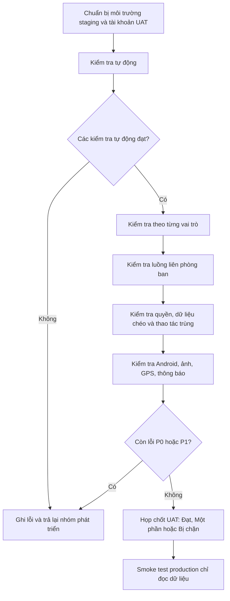

# Quy trình kiểm thử UAT cho tester

> Phiên bản tài liệu: 1.0  
> Áp dụng cho: Web ERP, cổng Khách hàng, cổng Nhà cung cấp và ứng dụng Android  
> Môi trường UAT: Cloudflare staging riêng, không dùng production để thử nghiệp vụ  
> Người dùng chính: Chủ cửa hàng, Kế toán, Thủ kho, Điều phối, Tài xế, Thợ, Khách hàng, Nhà cung cấp

## 1. Mục đích

Tài liệu này hướng dẫn tester kiểm tra hệ thống vận hành VLXD Hiền Xa một cách thống nhất, có bằng chứng và không làm sai dữ liệu tài chính hoặc kho.

Tester cần kiểm tra ba việc cùng lúc:

- Chức năng đúng với vai trò đang đăng nhập.
- Số lượng, tiền, kho và công nợ nhất quán sau mỗi bước.
- Người không có quyền không thể xem hoặc sửa dữ liệu của người khác.

Không dùng production để tạo đơn, nhập kho, thu tiền, chi tiền hoặc thử các thao tác có hậu quả tài chính. Production chỉ được smoke test các màn đọc dữ liệu, đăng nhập/đăng xuất và kiểm tra quyền truy cập cơ bản sau khi phát hành.

## 2. Quy tắc bắt buộc trước khi test

1. Chỉ dùng môi trường staging và dữ liệu có tiền tố `UAT-UXV2` hoặc `UAT-REM`.
2. Không dùng dữ liệu cá nhân thật, số tài khoản thật hoặc ảnh chứng từ thật.
3. Không ghi mật khẩu vào ảnh chụp, ticket lỗi, chat hoặc tài liệu này.
4. Mỗi lần test phải ghi lại mã đơn, mã phiếu, thời gian và tài khoản đang dùng.
5. Không sửa trực tiếp dữ liệu kho, công nợ, tiền công hoặc cơ sở dữ liệu để làm cho test đạt.
6. Nếu thấy số tiền, tồn kho hoặc công nợ sai, dừng luồng liên quan và ghi lỗi ngay.
7. Chỉ kết luận `Đạt` khi có kết quả thực tế và bằng chứng. Không dùng `Đạt` thay cho `Chưa kiểm tra`.

## 3. Sơ đồ quy trình kiểm thử



## 4. Các môi trường được phép dùng

| Môi trường | Dùng để làm gì | Không được làm gì |
|---|---|---|
| Máy local | Chạy test tự động, kiểm tra giao diện trước khi đưa lên staging | Không dùng để kết luận phát hành |
| Cloudflare staging | UAT đầy đủ, tạo dữ liệu test, kiểm quyền, test ảnh/GPS/thông báo | Không dùng dữ liệu thật hoặc tài khoản thật |
| Production `app.hienxavlxd.com` | Kiểm tra đăng nhập/đăng xuất, trang đọc dữ liệu, header bảo mật, API chưa đăng nhập | Không tạo chứng từ tài chính, không nhập kho, không tạo đơn test |

## 5. Chuẩn bị phiên UAT

### 5.1 Danh sách tài khoản tối thiểu

Chuẩn bị các tài khoản staging riêng biệt và được liên kết đúng hồ sơ:

| Vai trò | Tài khoản A | Tài khoản B dùng để kiểm tra dữ liệu chéo |
|---|---|---|
| Chủ cửa hàng | Owner | Không bắt buộc |
| Kế toán | Accountant | Không bắt buộc |
| Thủ kho | Warehouse | Không bắt buộc |
| Điều phối | Dispatcher | Không bắt buộc |
| Tài xế | Driver A | Driver B |
| Thợ | Worker A | Worker B |
| Khách hàng | Customer A | Customer B |
| Nhà cung cấp | Supplier A | Supplier B |

Tài xế A và B phải có nhân sự, xe và chuyến giao riêng. Khách A/B, NCC A/B phải có đơn và tệp đính kèm riêng để kiểm tra không xem chéo dữ liệu.

### 5.2 Dữ liệu UAT tối thiểu

- Hai khách hàng, hai nhà cung cấp, hai nhân sự thợ và hai tài xế.
- Ít nhất một vật tư, một kho, một đơn bán, một phiếu mua, một phiếu nhận hàng và một chuyến giao cho mỗi bên cần kiểm tra.
- Một công việc mở để kiểm tra thợ nhận việc đồng thời.
- Một ảnh giao hàng, một ảnh xác nhận của khách và một minh chứng thanh toán riêng tư.
- Một trường hợp tồn sắp hết hoặc hết hàng.
- Một trường hợp công nợ sắp đến hạn hoặc quá hạn.

## 6. Quy trình thực hiện chuẩn

### Bước 1: Chốt phiên bản và dữ liệu

1. Ghi Git SHA hoặc mã deployment staging vào biên bản.
2. Xác nhận URL staging là HTTPS và khác production.
3. Kiểm tra tất cả tài khoản UAT đăng nhập được đúng cổng.
4. Xác nhận fixture chưa bị trùng lịch xe/tài xế/chuyến giao.
5. Ghi ngày giờ bắt đầu, người thực hiện và dữ liệu UAT sử dụng.

### Bước 2: Chạy các gate tự động

Trên Windows, dùng `npm.cmd` và `npx.cmd`.

```powershell
npm.cmd run typecheck
npm.cmd test
npm.cmd run build
```

Chỉ chạy integration Cloudflare khi staging đã tách biệt hoàn toàn với production:

```powershell
npm.cmd run test:cloudflare-integration
```

Điều kiện bắt buộc cho integration Cloudflare:

- `ERP_RUN_CLOUDFLARE_INTEGRATION_TESTS=1`
- `ERP_TEST_CLOUDFLARE_CONFIRMATION=UAT-REM`
- `CLOUDFLARE_STAGING_BASE_URL` là URL HTTPS staging, khác production.
- D1, R2 và Queue của staging khác hoàn toàn production.
- `CLOUDFLARE_INTEGRATION_SECRET` có ít nhất 32 ký tự và chỉ lưu trong secret của môi trường.

Chạy E2E có đăng nhập bằng staging, không chạy vào production:

```powershell
powershell.exe -NoProfile -ExecutionPolicy Bypass -File scripts\uat\run-authenticated-e2e.ps1 -BaseUrl https://<staging-host>
```

Nếu thiếu URL staging hoặc tài khoản cho bất kỳ vai trò nào, trạng thái là `BỊ CHẶN`, không được bỏ qua test rồi ghi nhận là đạt.

### Bước 3: Kiểm tra theo vai trò

Dùng ma trận tại phần 7. Mỗi ca test phải ghi mã tài khoản, URL/màn hình, dữ liệu đầu vào, kết quả mong đợi, kết quả thực tế và ảnh/video nếu có lỗi.

### Bước 4: Kiểm tra luồng liên phòng ban

Chạy ít nhất một luồng đầy đủ theo phần 8. Không bỏ qua bước rà soát trước khi xác nhận các thao tác ảnh hưởng kho hoặc tiền.

### Bước 5: Kiểm tra lỗi và bảo mật

Chạy các kịch bản phần 9: đổi mã chứng từ trên URL/API, thao tác hai lần, hai người cùng xử lý và mất mạng. Kiểm tra không có dữ liệu bị lộ khi vai trò không có quyền.

### Bước 6: Kiểm tra Android

Chạy phần 10 trên emulator và tối thiểu hai máy Android thật: một máy Android 10-12, một máy Android 13 trở lên.

### Bước 7: Chốt kết quả

QA Lead tổng hợp kết quả theo `ĐẠT`, `MỘT PHẦN`, `BỊ CHẶN` hoặc `KHÔNG ĐẠT`:

- `ĐẠT`: có bằng chứng, đúng mong đợi và không có lỗi mở.
- `MỘT PHẦN`: chức năng chính chạy nhưng thiếu bằng chứng hoặc còn giới hạn đã biết.
- `BỊ CHẶN`: thiếu môi trường, tài khoản, quyền, thiết bị hoặc cấu hình; không được coi là đạt.
- `KHÔNG ĐẠT`: có lỗi tái hiện được hoặc làm sai dữ liệu/quyền.

## 7. Ma trận kiểm thử theo vai trò

| Vai trò | Cần kiểm tra | Không được phép thấy hoặc làm |
|---|---|---|
| Chủ cửa hàng | Tổng quan, phê duyệt, quản trị tài khoản, báo cáo, kiểm kê, theo dõi giao hàng | Không được bỏ qua bước xác nhận hoặc thay đổi chứng từ đã ghi sổ trực tiếp |
| Kế toán | Công nợ, thu/chi, phân bổ thanh toán, phê duyệt kiểm kê, báo cáo tiền | Không được sửa trực tiếp số dư công nợ hoặc số tiền chứng từ đã xác nhận |
| Thủ kho | Nhập/xuất, chuyển kho, kiểm kê, cảnh báo sắp hết/hết hàng | Không được tự duyệt và ghi chênh lệch kiểm kê; không sửa số dư tồn trực tiếp |
| Điều phối | Tạo/gán chuyến, chuyển trạng thái, theo dõi bản đồ, duyệt giao theo quyền | Không được xem giá vốn, biên lợi nhuận hoặc tự ghi kho/công nợ nếu không có quyền |
| Tài xế | Chỉ chuyến được giao, GPS, ảnh giao, báo chênh lệch | Không được sửa số lượng giao, xem tồn nội bộ, giá vốn, biên lợi nhuận hoặc công nợ |
| Thợ | Chỉ công việc được giao/mở đủ điều kiện, nhận việc, gửi sản lượng/ảnh | Không được xem giá bán, giá vốn, tồn kho, công nợ; không được nhận cùng một việc đã có người nhận |
| Khách hàng | Đặt đơn, xem đơn/công nợ của mình, gửi minh chứng, chat, xác nhận giao | Không được xem dữ liệu khách khác, giá vốn, biên lợi nhuận hoặc thông tin tài xế không cần thiết |
| Nhà cung cấp | Chỉ đơn mua của mình, phản hồi khả năng hàng, báo giao, chứng từ, công nợ riêng, chat | Không được xem PO/NCC khác, tự ghi kho, tự tạo công nợ hoặc phiếu chi |

## 8. Kịch bản nghiệp vụ xuyên suốt

### TC-FLOW-01: Bán hàng, mua hàng, giao hàng và thanh toán

1. Khách A đăng nhập, chọn vật tư và tạo đơn nháp.
2. Kiểm tra giá, VAT, chiết khấu, phí giao và điều khoản hiển thị chỉ là dự kiến trước khi gửi đơn.
3. Nhân viên/chủ cửa hàng xác nhận đơn. Kiểm tra server giữ snapshot giá của đơn, không lấy giá do trình duyệt tự tính.
4. Cấp nguồn từ kho hoặc tạo phiếu mua cho NCC A.
5. NCC A chỉ xem phiếu của mình, phản hồi và gửi báo giao. Kiểm tra phản hồi chỉ tạo yêu cầu chờ duyệt.
6. Thủ kho nhận hàng hoặc xác nhận giao thẳng khách theo workflow được phép.
7. Điều phối tạo và gán chuyến cho tài xế A. Tài xế A bắt đầu chuyến, gửi ảnh hoặc báo chênh lệch; không có ô sửa số lượng.
8. Khách A đăng nhập, xem chuyến của mình và gửi ảnh xác nhận nhận hàng.
9. Người có quyền duyệt hoàn tất giao. Kiểm tra tồn kho/phải thu chỉ phát sinh đúng theo workflow và không tạo hai lần khi bấm lại.
10. Kế toán tạo phiếu thu hoặc đối soát minh chứng, phân bổ vào đơn. Kiểm tra tổng phân bổ không vượt số tiền phiếu hoặc số dư phải thu.
11. Kiểm tra nhật ký hoạt động có người làm, thời điểm, chứng từ nguồn và kết quả của các bước chính.

### TC-FLOW-02: Thợ nhận công việc đồng thời

1. Tạo một công việc mở cho hai thợ đủ điều kiện.
2. Đăng nhập Worker A và Worker B ở hai trình duyệt hoặc hai thiết bị.
3. Hai người bấm `Nhận việc` gần như cùng lúc.
4. Kỳ vọng: chỉ một người thành công; người còn lại nhận lỗi nghiệp vụ rõ ràng, ví dụ `Công việc đã có người nhận`.
5. Lặp lại request thành công cùng mã chống chạy trùng. Kỳ vọng: không tạo gán việc hay tiền công trùng.
6. Kiểm tra Worker không xem được giá bán, giá vốn, tồn kho hoặc công nợ.

### TC-FLOW-03: Phiếu kiểm kê kho

1. Thủ kho tạo phiếu kiểm kê cho kho được phân công.
2. Kiểm tra phiếu tự nạp vật tư có tồn hoặc đã cấu hình tại kho; có thể bỏ qua dòng chưa kiểm và thêm vật tư có số sổ bằng 0.
3. Nhập số đếm cho một dòng có chênh lệch. Kỳ vọng: bắt buộc có lý do và ít nhất một ảnh/biên bản riêng tư.
4. Gửi phiếu chờ duyệt. Thủ kho không thấy nút `Duyệt và ghi kho`.
5. Tạo phát sinh kho trên một dòng trước khi duyệt. Kỳ vọng: dòng đó chuyển sang yêu cầu kiểm lại; toàn phiếu không được ghi kho.
6. Chủ cửa hàng hoặc Kế toán duyệt. Kỳ vọng: mỗi dòng chênh lệch chỉ sinh một phát sinh kho, có nhật ký và không sửa số dư tồn trực tiếp.
7. Đảo phiếu đã ghi. Kỳ vọng: có phát sinh ngược, không làm tồn âm và dashboard/cảnh báo cập nhật lại.

## 9. Kịch bản quyền, lỗi và thao tác trùng

### 9.1 Kiểm tra dữ liệu chéo

Với Customer A/Supplier A/Worker A/Driver A, lần lượt thử thay mã đối tượng bằng dữ liệu B:

- Mã khách hàng, nhà cung cấp, nhân sự.
- Mã đơn bán, phiếu mua, chuyến giao, công việc.
- Mã tệp ảnh/chứng từ, thông báo, cuộc trò chuyện và truy vấn xuất báo cáo.

Kỳ vọng: trả `403` hoặc `404` an toàn; không trả tên, số tiền, ảnh hoặc thông tin nhận dạng của bên B.

### 9.2 Mã trạng thái API cần hiểu

| Mã | Ý nghĩa cho tester | Kỳ vọng |
|---|---|---|
| `401` | Chưa đăng nhập, token hết hạn hoặc sai xác thực | Yêu cầu đăng nhập lại, không lộ thông tin phiên |
| `403` | Đã đăng nhập nhưng không có quyền | Không lộ dữ liệu ngoài phạm vi |
| `400` | Dữ liệu gửi lên không hợp lệ | Hiện hướng dẫn sửa dữ liệu dễ hiểu |
| `409` | Có người khác đã sửa hoặc xử lý trước | Yêu cầu tải lại và kiểm tra dữ liệu mới |
| `412` | Trạng thái chứng từ không còn phù hợp thao tác | Hiện trạng thái hiện tại và hướng dẫn tiếp theo |
| `500` | Lỗi hệ thống | Hiện mã đối chiếu không nhạy cảm, không lộ stack trace |

### 9.3 Kiểm tra thao tác trùng và đồng thời

Áp dụng cho tạo chứng từ, phê duyệt, ghi kho, thu/chi, phân bổ, nhận việc và upload:

1. Bấm nút xác nhận hai lần nhanh.
2. Gửi lại request sau khi giả lập timeout.
3. Mở cùng chứng từ ở hai tab, lưu ở tab thứ nhất rồi lưu tab thứ hai.
4. Để hai người có quyền cùng duyệt một chứng từ.

Kỳ vọng: chỉ ghi một lần; lần sau trả kết quả idempotent hoặc thông báo xung đột rõ ràng; không có phát sinh kho, sổ tiền, công nợ, tiền công hoặc tệp đính kèm trùng.

## 10. Checklist Android

### 10.1 Kiểm tra chung

- Không có WebView, Chrome hoặc fallback mở trình duyệt ngoài trong app.
- Chữ nội dung từ 16px, nút thao tác chính tối thiểu 48px.
- Nút Back quay lại màn hợp lý, không tự thoát app giữa luồng.
- Khi mất mạng: chỉ giữ dữ liệu đọc, nháp không tài chính, ảnh/GPS trong giới hạn; không tự ghi phiếu tài chính khi có mạng lại.
- Khi logout hoặc nhận `401`: xóa phiên, hàng đợi GPS, consent GPS và đăng ký thông báo trên thiết bị.

### 10.2 GPS, ảnh và thông báo

- Tài xế chỉ được bật GPS khi được gán chuyến và chuyến đang giao.
- Hiện rõ hỏi quyền vị trí; test `Cho phép`, `Từ chối`, `Dừng chia sẻ`, hoàn tất/hủy chuyến và logout.
- Tài xế xem được điểm đến/tuyến của chuyến mình; nút dẫn đường chỉ mở ứng dụng bản đồ thiết bị.
- Khách chỉ thấy vị trí làm mờ của chuyến của mình, không thấy danh tính hoặc lịch sử quá mức cần thiết.
- Bật/tắt thông báo phải có trạng thái thật; logout phải hủy đăng ký; nội dung push không có tiền, công nợ hoặc dữ liệu nhạy cảm.
- Ảnh giao, ảnh xác nhận và minh chứng tải lên/tải xuống theo quyền; không có URL công khai cho tệp riêng tư.

## 11. Mẫu test case

Sao chép mẫu này cho từng test case:

```text
Mã test: TC-<MODULE>-<SỐ>
Ngày giờ:
Người kiểm tra:
Môi trường / mã deployment:
Vai trò / tài khoản:
Dữ liệu UAT và mã chứng từ:
Tiền điều kiện:
Bước thực hiện:
Kết quả mong đợi:
Kết quả thực tế:
Trạng thái: ĐẠT / KHÔNG ĐẠT / MỘT PHẦN / BỊ CHẶN
Bằng chứng: ảnh, video, request ID, audit ID
Liên kết lỗi (nếu có):
```

## 12. Mẫu báo lỗi

Mỗi lỗi có mã `UAT-YYYYMMDD-###` và ghi theo mẫu:

```text
Mã lỗi:
Mức độ: P0 / P1 / P2 / P3
Module và vai trò:
Môi trường / deployment:
Dữ liệu trước khi lỗi:
Bước tái hiện ngắn gọn:
Kết quả mong đợi:
Kết quả thực tế:
Ảnh/video/log đã che dữ liệu nhạy cảm:
Ảnh hưởng kho / tiền / công nợ / quyền dữ liệu:
Tần suất tái hiện:
Nguyên nhân gốc (nhóm phát triển cập nhật):
Test hồi quy cần thêm:
```

### Quy ước mức độ lỗi

| Mức độ | Ý nghĩa |
|---|---|
| P0 | Mất dữ liệu, lộ dữ liệu nghiêm trọng, sai tiền/kho diện rộng, không thể vận hành |
| P1 | Sai quyền, ghi trùng, sai trạng thái trọng yếu, chặn một vai trò hoặc luồng nghiệp vụ chính |
| P2 | Có đường vòng an toàn, ảnh hưởng một phần chức năng hoặc giao diện khó dùng |
| P3 | Lỗi chữ, căn chỉnh, nhãn chưa rõ nhưng không làm sai nghiệp vụ |

P0/P1 phải được báo ngay, dừng ca test liên quan và không phát hành cho đến khi có sửa lỗi + test hồi quy đạt.

## 13. Tiêu chí chốt UAT và phát hành

Chỉ đề xuất phát hành khi tất cả điều kiện sau đạt:

- Typecheck, unit test, mobile test và web build đều đạt.
- Cloudflare staging integration đạt: D1, R2, Queue, CAS, idempotency, rollback và reconciliation bằng `0`.
- E2E có đăng nhập chạy đủ 8 vai trò và kiểm tra dữ liệu chéo, không bị skip.
- Có ít nhất một luồng đầy đủ Khách hàng → Cửa hàng → NCC/Kho → Giao hàng → Khách xác nhận → Kế toán đối soát.
- Không còn P0/P1 mở.
- Không có dữ liệu nhạy cảm lộ qua portal, API, export, chat, tệp hoặc thông báo.
- Android có bằng chứng emulator và hai máy thật cho login, ảnh, GPS, thông báo, logout và mất mạng.
- Production smoke chỉ đọc dữ liệu đạt sau deploy.

Nếu thiếu staging, credential, thiết bị hoặc binding Cloudflare, kết quả phải là `BỊ CHẶN`; không được nâng thành `ĐẠT` chỉ vì code build thành công.

## 14. Trạng thái baseline hiện tại để tester biết

Kết quả kiểm tra kỹ thuật gần nhất ngày 08/08/2026:

| Hạng mục | Trạng thái | Ghi chú |
|---|---|---|
| Typecheck web | ĐẠT | Kiểm tra kiểu TypeScript thành công |
| Full Vitest | ĐẠT | `493/493` test đạt |
| Web production build | ĐẠT | Build Next.js thành công |
| Dependency audit runtime | ĐẠT | Không có lỗ hổng runtime High/Critical đã phát hiện |
| Cloudflare staging integration | BỊ CHẶN | Cần binding staging tách biệt và secret integration |
| Authenticated E2E/IDOR | BỊ CHẶN | Cần URL staging và tài khoản UAT đủ 8 vai trò + tài khoản B |
| Quét Worker bundle | BỊ CHẶN | Cần runner Linux/CI không bị chặn symlink Windows |
| Maestro và UAT máy thật | BỊ CHẶN | Cần hai thiết bị Android và bằng chứng phiên test |
| Liên kết tài khoản thợ production | BỊ CHẶN | Chỉ làm sau backup, dry-run và xác nhận riêng của Chủ cửa hàng |

Baseline này không phải tuyên bố production ready. QA Lead chỉ đổi trạng thái sau khi các mục `BỊ CHẶN` có bằng chứng hoàn tất trên staging/UAT phù hợp.

## 15. Liên hệ khi cần hỗ trợ

Khi tester bị chặn, gửi cho QA Lead hoặc nhóm phát triển:

- Mã test hoặc mã lỗi.
- Vai trò và môi trường đang dùng.
- Mã đơn/phiếu/chuyến/công việc UAT.
- Thời gian xảy ra lỗi theo giờ Việt Nam.
- Ảnh hoặc video đã che mật khẩu, token và thông tin nhạy cảm.
- Kết quả mong đợi và kết quả thực tế trong một hoặc hai câu rõ ràng.

Không gửi mật khẩu, cookie, Bearer token, recovery token, khóa API hoặc ảnh chứng từ thật qua chat.
